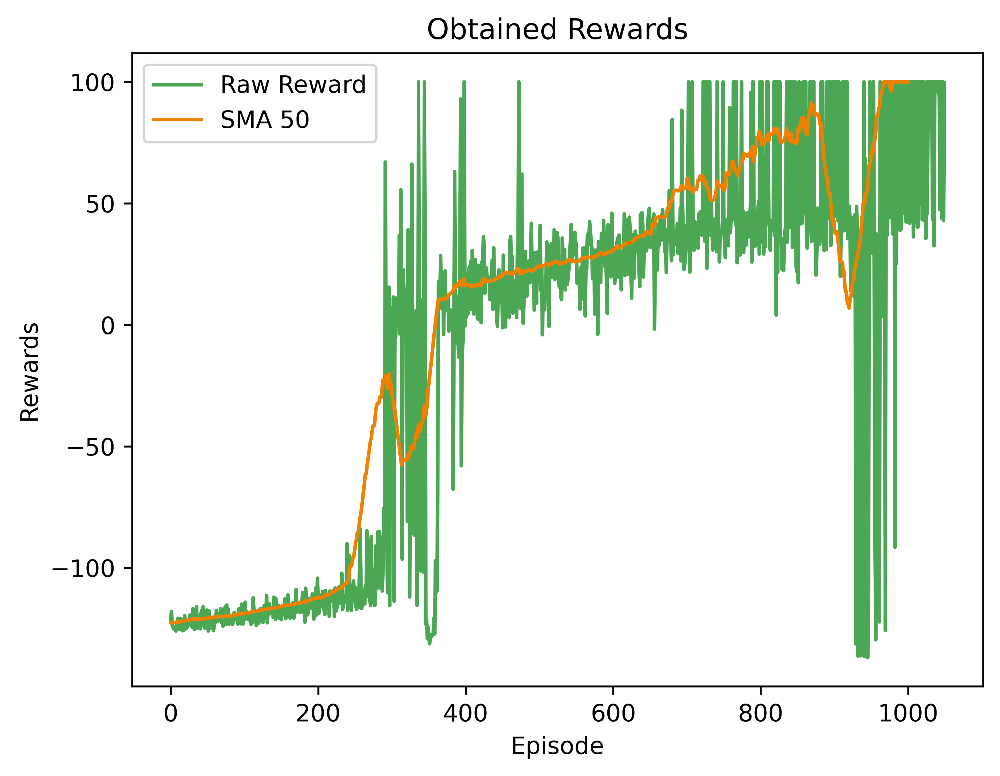
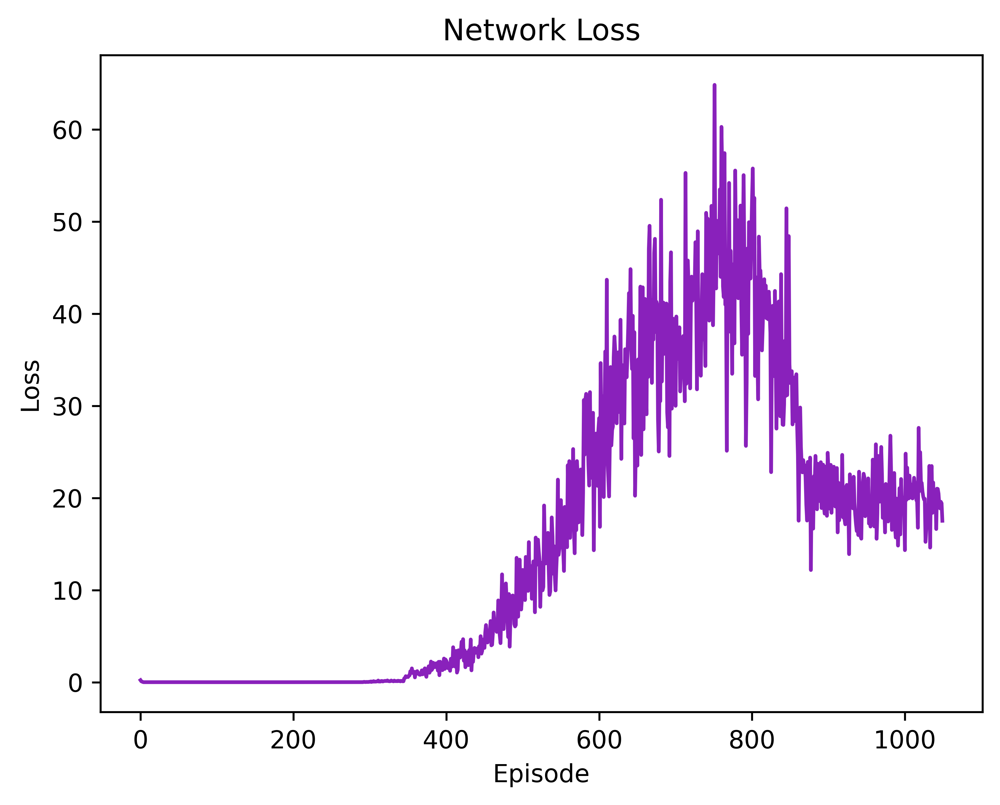

## Description
Welcome to this repository! Here, you will find a Python implementation of the Deep Q-Network (DQN) algorithm. The purpose of this repository is to showcase the effectiveness of the DQN algorithm by applying it to the [Mountain Car v0](https://gymnasium.farama.org/environments/classic_control/mountain_car/) environment (discrete version) provided by the Gymnasium library. The task for the agent is to ascend the mountain to the right, yet the car's engine lacks the power to ascend the slope in one continuous motion. Consequently, success hinges on navigating back and forth to accumulate momentum for the climb. This scenario effectively mirrors real-life situations where unwise choices can result in unfavorable outcomes, thus emphasizing the importance of far-sighted strategic decision-making. This implementation serves as a resource for enthusiasts and practitioners seeking to comprehend and implement DQN in their endeavors.

## Deep Q-Network (DQN)
The DQN algorithm is a value-based, model-free, and off-policy approach renowned for its capacity to learn optimal policies from high-dimensional input spaces. Originating from the efforts of researchers at DeepMind, DQN merges deep neural networks with traditional Q-learning to approximate the optimal state-action value function (Q function). The major pros and cons of the algorithm are as follows:

###### Advantages:
1. 	**Experience Replay Memory:** By utilizing exploration strategies like the epsilon-greedy policy and employing techniques such as experience replay, DQN significantly enhances sample efficiency and stabilizes the learning process for its main policy. This approach allows the algorithm to learn more effectively from past experiences and facilitates smoother convergence toward optimal policies.

###### Disadvantages:
1. 	**Hyperparameter Sensitivity:** DQN performance relies on tuning many hyperparameters, which makes it challenging to achieve optimal results in different environments.

2. 	**Training Instability:** During training, DQN may encounter instability, primarily originating from the dynamic nature of the target network. Furthermore, performance collapse can occur, presenting a scenario where DQN struggles to recover through learning, potentially hindering its training progress.

## Solution
The primary challenge in training the agent within this environment stems from the inadequacy of the reward function, which fails to provide the necessary guidance for the agent to learn optimal action sequences. The existing reward function offers no assistance whatsoever. As a result, the agent must rely solely on random action selection during exploration—a strategy that necessitates an extensive number of training episodes. It's only through this process that, eventually, the agent may chance upon a successful trajectory leading to the goal. However, the likelihood of this occurrence during exploration is exceedingly low, prolonging the training process significantly.
To expedite convergence, it becomes crucial to modify the default reward function of the environment and introduce a custom alternative. Leveraging gymnasium wrappers, we can seamlessly integrate our tailored reward function, designed to facilitate faster convergence and enable the agent to ascend the hill toward the goal.

## Requirements
The code is implemented in Python 3.8.10 and has been tested on Windows 10 without encountering any issues. Below are the non-standard libraries and their corresponding versions used in writing the code:
<pre>
gymnasium==0.29.1
matplotlib==3.5.1
numpy==1.22.0
pygame==2.5.2
torch==2.0.1+cu118
</pre>

**Note:** This repository uses the latest version of Gymnasium for compatibility and optimization purposes. This code does not utilize any deprecated or old versions of the Gym library.

## Usage
The network final weights are pre-saved in the root directory `./final_weights_1000.pth`. There is no need to initiate training from the beginning for testing the code. Upon executing the code, the weights will automatically be loaded, allowing seamless rendering and testing. Have fun in the environment!

## Showcase
You can view the training procedure through the following GIFs, demonstrating the learned process across episodes.

  
  
  

  
  
  

### Results
Here is a summary of the training outcomes over 1050 episodes. The plots depict the raw rewards obtained, along with the Simple Moving Average (SMA) of 50 rewards (SMA 50), and the network loss during training. It's worth noting that an additional 50 episodes were included beyond the 1000 episodes only to compute the SMA 50 for smoother analysis.

  
  

## Persian Tutorial Video
[Here](https://youtu.be/499D1B1cGuw) is a video tutorial in Persian that delves into the implementation, covering the environment characteristics, essential hints to solve the task, and the custom reward function and its details.

I genuinely hope this repository proves valuable to those on the learning path. If you find this repository beneficial in your journey, consider fueling this work by endorsing it.

## Beyond Climbing the Mountain
Explore my solutions for various environments within the Gymnasium library, each presenting captivating challenges that showcase the exciting applications of deep reinforcement learning techniques. Some of these solved environments include:

###### Toy Text Environments:
1. [Frozen Lake v1](https://github.com/MehdiShahbazi/DQN-Frozenlake-Gymnasium) &#8594; Solved with DQN algorithm
2. [Cliff Walking v0](https://github.com/MehdiShahbazi/DQN-Cliff-Walking-Gymnasium) &#8594; Solved with DQN algorithm

###### Classic Control Environments:
1. [Cart Pole v1](https://github.com/MehdiShahbazi/REINFORCE-Cart-Pole-Gymnasium) &#8594; Solved with REINFORCE algorithm
